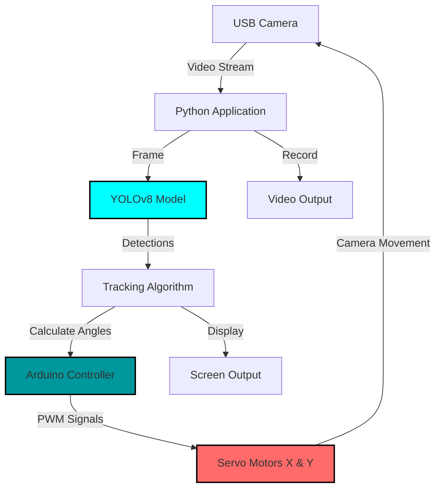

<div align="center">
  
</div>

<div align="center">
  
  
  
  
  
  
  
</div>

<div align="center">
  <h3>🎓 Graduation Project - Dicle University</h3>
  <p><i>An autonomous system combining computer vision, deep learning, and robotics</i></p>
</div>

---

## 📑 Table of Contents

<details>
<summary>Click to expand</summary>

- [🌟 Overview](#-overview)
- [✨ Key Features](#-key-features)
- [🎬 Demo & Results](#-demo--results)
- [🏗️ System Architecture](#️-system-architecture)
- [🚀 Quick Start](#-quick-start)
- [🔌 Hardware Setup](#-hardware-setup)
- [💻 Usage Guide](#-usage-guide)
- [⚙️ Configuration](#️-configuration)
- [🔧 How It Works](#-how-it-works)
- [📁 Project Structure](#-project-structure)
- [🐛 Troubleshooting](#-troubleshooting)
- [🤝 Contributing](#-contributing)
- [📄 License](#-license)
- [📧 Contact](#-contact)

</details>

---

## 🌟 Overview

This **Autonomous Vision Tracking System** represents a cutting-edge integration of artificial intelligence and robotics, developed as a graduation project at **Dicle University**. The system leverages the power of **YOLOv8 deep learning** and **OpenCV** to perform real-time human detection and tracking, autonomously controlling **Arduino-based servo motors** to maintain visual lock on targets.

### 🎯 Project Goals

- Develop an intelligent tracking system for autonomous surveillance
- Integrate deep learning with physical hardware control
- Create a scalable platform for robotics and computer vision applications
- Demonstrate real-world AI implementation in embedded systems

### 🛠️ Core Technologies

<table>
  <tr>
    <td align="center" width="25%">
      <br />
      <b>Object Detection</b><br />
      State-of-the-art neural network
    </td>
    <td align="center" width="25%">
      <br />
      <b>Image Processing</b><br />
      Real-time video analysis
    </td>
    <td align="center" width="25%">
      <br />
      <b>Motor Control</b><br />
      Servo positioning system
    </td>
    <td align="center" width="25%">
      <br />
      <b>Async Processing</b><br />
      Lag-free operation
    </td>
  </tr>
</table>

---

## ✨ Key Features

### 🎯 Detection & Tracking

<table>
  <tr>
    <td width="50%">
      <h4>🔍 Real-time Detection</h4>
      <ul>
        <li>YOLOv8 model with 60+ FPS capability</li>
        <li>Confidence-based filtering (adjustable threshold)</li>
        <li>Multiple target handling with priority selection</li>
        <li>Class-specific detection (person, vehicle, etc.)</li>
      </ul>
    </td>
    <td width="50%">
      <h4>🎯 Intelligent Tracking</h4>
      <ul>
        <li>Smooth servo motor movements</li>
        <li>Predictive target positioning</li>
        <li>Lost target recovery mechanism</li>
        <li>Automatic scanning mode activation</li>
      </ul>
    </td>
  </tr>
</table>

### 🔧 Hardware Integration

- **Arduino Communication**: Serial protocol with multi-threaded buffering
- **Pan-Tilt Mechanism**: 2-axis servo control with 180° range
- **Configurable Parameters**: Speed, acceleration, and angle limits
- **Safety Features**: Emergency stop and mechanical limit protection

### 📹 Recording & Visualization

- **Video Recording**: Optional MP4 output with configurable quality
- **Real-time Overlay**: Bounding boxes, confidence scores, FPS counter
- **Distance Estimation**: Approximate target distance calculation
- **Debug Mode**: Detailed logging and performance metrics

### 🧠 Smart Features

- **Adaptive Scanning**: Intelligent search pattern when target is lost
- **Zone-based Detection**: Configurable detection areas and exclusions
- **Proximity Alerts**: Distance-based action triggering
- **Auto-calibration**: Servo center position adjustment

---

## 🎬 Demo & Results

### 📸 System in Action

<div align="center">
  <table>
    <tr>
      <td align="center">
        <br />
        <b>Real-time Detection</b><br />
        <i>YOLOv8 identifying human targets</i>
      </td>
      <td align="center">
        <br />
        <b>Tracking Mode</b><br />
        <i>Camera following target movement</i>
      </td>
      <td align="center">
        <br />
        <b>Multi-target Handling</b><br />
        <i>Priority-based selection</i>
      </td>
    </tr>
  </table>
</div>

### 🤖 Hardware Setup

<div align="center">
  <table>
    <tr>
      <td align="center" width="50%">
        <br />
        <b>Front View</b><br />
        <i>Pan-tilt mechanism with camera mount</i>
      </td>
      <td align="center" width="50%">
        <br />
        <b>Side View</b><br />
        <i>Arduino controller and servo motors</i>
      </td>
    </tr>
  </table>
</div>

### 📊 Performance Metrics

<table align="center">
  <tr>
    <th>Metric</th>
    <th>Value</th>
    <th>Description</th>
  </tr>
  <tr>
    <td>⚡ Detection Speed</td>
    <td><b>40-60 FPS</b></td>
    <td>On standard laptop GPU</td>
  </tr>
  <tr>
    <td>🎯 Detection Accuracy</td>
    <td><b>~85%</b></td>
    <td>YOLOv8n on COCO dataset</td>
  </tr>
  <tr>
    <td>🔄 Tracking Latency</td>
    <td><b>&lt;100ms</b></td>
    <td>From detection to servo movement</td>
  </tr>
  <tr>
    <td>📐 Pan Range</td>
    <td><b>180°</b></td>
    <td>Horizontal coverage</td>
  </tr>
  <tr>
    <td>📐 Tilt Range</td>
    <td><b>120°</b></td>
    <td>Vertical coverage</td>
  </tr>
</table>

---

## 🏗️ System Architecture

<div align="center">



</div>

### 📊 Data Flow Diagram

```
┌─────────────────────────────────────────────────────────────┐
│                    INITIALIZATION PHASE                      │
├─────────────────────────────────────────────────────────────┤
│  1. Load YOLOv8 Model → 2. Connect Arduino → 3. Open Camera │
└────────────────────────┬────────────────────────────────────┘
                         ▼
┌─────────────────────────────────────────────────────────────┐
│                     MAIN PROCESSING LOOP                     │
├─────────────────────────────────────────────────────────────┤
│                                                               │
│  ┌──────────┐    ┌──────────┐    ┌──────────┐              │
│  │ Capture  │───▶│  YOLO    │───▶│ Extract  │              │
│  │  Frame   │    │Detection │    │ Bounding │              │
│  └──────────┘    └──────────┘    │   Box    │              │
│                                   └────┬─────┘              │
│                                        ▼                     │
│  ┌──────────┐    ┌──────────┐    ┌──────────┐              │
│  │  Send to │◀───│Calculate │◀───│ Compute  │              │
│  │ Arduino  │    │  Angles  │    │  Center  │              │
│  └────┬─────┘    └──────────┘    └──────────┘              │
│       │                                                      │
│       ▼                                                      │
│  ┌──────────┐    ┌──────────┐                              │
│  │  Servo   │───▶│  Camera  │                              │
│  │Movement  │    │Adjustment│                              │
│  └──────────┘    └──────────┘                              │
│                                                               │
└─────────────────────────────────────────────────────────────┘
```

---

## 🚀 Quick Start

### 📋 Prerequisites

Before you begin, ensure you have the following installed:

- ✅ **Python 3.8+** ([Download](https://www.python.org/downloads/))
- ✅ **Arduino IDE** ([Download](https://www.arduino.cc/en/software))
- ✅ **Git** ([Download](https://git-scm.com/downloads))
- ✅ **USB Webcam** or compatible camera
- ✅ **Arduino Board** (Uno, Nano, or Mega)
- ✅ **2x Servo Motors** (SG90 recommended)

### 📥 Installation Steps

#### 1️⃣ Clone the Repository

```bash
git clone https://github.com/Ai-rezzak/autonomous-system-vision-deep-learning.git
cd autonomous-system-vision-deep-learning
```

#### 2️⃣ Create Virtual Environment (Recommended)

```bash
# Windows
python -m venv venv
venv\Scripts\activate

# Linux/Mac
python3 -m venv venv
source venv/bin/activate
```

#### 3️⃣ Install Dependencies

```bash
pip install -r requirements.txt
```

**requirements.txt:**
```txt
opencv-python>=4.8.0
opencv-contrib-python>=4.8.0
ultralytics>=8.0.0
pyserial>=3.5
cvzone>=1.6.0
numpy>=1.24.0
```

#### 4️⃣ Download YOLO Model

The YOLOv8n model will auto-download on first run, or manually:

```bash
# Create directory
mkdir -p models/pretrained

# Download from Ultralytics
# Model auto-downloads to: models/pretrained/yolov8n.pt
```

#### 5️⃣ Arduino Setup

1. Open Arduino IDE
2. Load sketch: `arduino/servo_control/servo_control.ino`
3. Select board: **Tools → Board → Arduino Uno**
4. Select port: **Tools → Port → COMx** (Windows) or **/dev/ttyUSB0** (Linux)
5. Click **Upload** ⬆️
6. **Important**: Note your COM port for later configuration

#### 6️⃣ First Run

```bash
# Update ARDUINO_PORT in otonom_silah.py (line ~15)
ARDUINO_PORT = "COM7"  # Change to your port

# Run the application
python otonom_silah.py
```

---

## 🔌 Hardware Setup

### 🛒 Components List

<table>
  <tr>
    <th>Component</th>
    <th>Specification</th>
    <th>Quantity</th>
    <th>Approx. Cost</th>
  </tr>
  <tr>
    <td>🖥️ Arduino Board</td>
    <td>Uno / Nano / Mega</td>
    <td>1</td>
    <td>$10-25</td>
  </tr>
  <tr>
    <td>⚙️ Servo Motors</td>
    <td>SG90 (9g micro servo)</td>
    <td>2</td>
    <td>$3-6</td>
  </tr>
  <tr>
    <td>📹 USB Webcam</td>
    <td>720p or higher</td>
    <td>1</td>
    <td>$15-30</td>
  </tr>
  <tr>
    <td>🔩 Pan-Tilt Bracket</td>
    <td>2-axis servo mount</td>
    <td>1</td>
    <td>$5-10</td>
  </tr>
  <tr>
    <td>🔌 Jumper Wires</td>
    <td>Male-to-Male</td>
    <td>10</td>
    <td>$2</td>
  </tr>
  <tr>
    <td>🔋 Power Supply</td>
    <td>5V 2A adapter</td>
    <td>1</td>
    <td>$5-8</td>
  </tr>
  <tr>
    <td>🔗 USB Cable</td>
    <td>Type-A to Type-B</td>
    <td>1</td>
    <td>$3</td>
  </tr>
  <tr>
    <td>⚡ Capacitor (optional)</td>
    <td>1000µF 16V</td>
    <td>1</td>
    <td>$1</td>
  </tr>
</table>

**Total Cost: ~$45-90 USD**

### 🔧 Wiring Diagram

<div align="center">

```
┌─────────────────────────────────────────────────────┐
│                    Arduino UNO                       │
│  ┌────────────────────────────────────────────┐    │
│  │                                              │    │
│  │  [5V] ────────┬─────────────┬──────────────┤    │
│  │               │             │              │    │
│  │  [GND]────────┼─────────────┼──────────────┤    │
│  │               │             │              │    │
│  │  [D9] ────────┤             │              │    │
│  │               │             │              │    │
│  │  [D10]────────┤             │              │    │
│  │               │             │              │    │
│  └───────────────┼─────────────┼──────────────┘    │
│                  │             │                     │
└──────────────────┼─────────────┼─────────────────────┘
                   │             │
         ┌─────────▼──┐    ┌────▼──────┐
         │  Servo X   │    │  Servo Y  │
         │   (Pan)    │    │  (Tilt)   │
         ├────────────┤    ├───────────┤
         │ Red   → 5V │    │ Red  → 5V │
         │ Brown → GND│    │ Brown→ GND│
         │ Orange→ D9 │    │Orange→ D10│
         └────────────┘    └───────────┘
```

</div>

### ⚠️ Important Wiring Notes

1. **Power Supply**: 
   - For best performance, use **external 5V power supply** for servos
   - Connect Arduino and servo grounds together (common ground)
   - USB power may be insufficient for servo operation

2. **Capacitor (Recommended)**:
   - Place **1000µF capacitor** between servo VCC and GND
   - Reduces electrical noise and voltage spikes
   - Improves servo stability

3. **Cable Management**:
   - Keep servo wires short to reduce noise
   - Avoid running signal wires parallel to power wires
   - Use shielded cables for long distances

### 📷 Assembly Guide

<details>
<summary><b>Step-by-step assembly instructions (Click to expand)</b></summary>

1. **Mount Servos on Pan-Tilt Bracket**
   - Attach X-axis (pan) servo to base
   - Attach Y-axis (tilt) servo to pan arm
   - Secure with included screws

2. **Attach Camera**
   - Mount webcam on tilt platform
   - Ensure camera lens is centered
   - Use zip ties or camera mount

3. **Connect Servos to Arduino**
   - Follow wiring diagram above
   - Double-check polarity (Red=5V, Brown=GND, Orange=Signal)
   - Use quality jumper wires

4. **Connect Power**
   - Option A: USB only (for testing, low power)
   - Option B: External 5V supply + USB (recommended)
   - Option C: Battery pack for portable operation

5. **Final Checks**
   - Verify all connections are secure
   - Test servo range manually
   - Upload Arduino sketch
   - Run Python application

</details>

---

## 💻 Usage Guide

### 🎮 Basic Operations

#### Starting the System

```bash
# Basic start with default settings
python otonom_silah.py

# Specify camera index (if multiple cameras)
python otonom_silah.py --camera 0

# Disable video recording
python otonom_silah.py --no-record

# Custom Arduino port
python otonom_silah.py --port COM3

# Combination
python otonom_silah.py --camera 1 --port COM7 --no-record
```

### ⌨️ Keyboard Controls

| Key | Action | Description |
|-----|--------|-------------|
| `Q` | Quit | Close application |
| `R` | Record Toggle | Start/stop video recording |
| `S` | Screenshot | Save current frame |
| `C` | Calibrate | Reset servo to center |
| `D` | Debug Mode | Toggle debug overlay |
| `ESC` | Emergency Stop | Immediately halt all servos |
| `SPACE` | Pause/Resume | Pause tracking |

### 📝 Command Line Arguments

```bash
python otonom_silah.py [OPTIONS]

Options:
  --camera INDEX        Camera device index (default: 1)
  --port PORT           Arduino serial port (default: COM7)
  --baud RATE          Serial baud rate (default: 115200)
  --no-record          Disable video recording
  --resolution WxH     Camera resolution (default: 640x480)
  --confidence FLOAT   Detection threshold 0-1 (default: 0.5)
  --help               Show this help message
```

### 🎯 First Run Checklist

- [ ] Arduino sketch uploaded and tested
- [ ] Servos connected and centered (90°, 110°)
- [ ] Camera connected and recognized by OS
- [ ] ARDUINO_PORT updated in code
- [ ] Python dependencies installed
- [ ] Power supply sufficient for servos
- [ ] Servos move freely without obstruction

### 🔍 Testing Procedure

1. **Servo Test**:
   ```bash
   # Test servo movement without camera
   python test_servos.py
   ```

2. **Camera Test**:
   ```bash
   # Verify camera feed
   python test_camera.py
   ```

3. **Detection Test**:
   ```bash
   # Test YOLO detection only
   python test_detection.py
   ```

4. **Full System**:
   ```bash
   # Run complete system
   python otonom_silah.py
   ```

---

## ⚙️ Configuration

### 🔧 Main Settings (`otonom_silah.py`)

```python
# ============== CAMERA SETTINGS ==============
CAMERA_INDEX = 1              # Camera device ID (0=default, 1=USB)
WS, HS = 640, 480            # Frame resolution (width x height)
H_FOV = 75.7                 # Horizontal field of view (degrees)
V_FOV = 50.0                 # Vertical field of view (degrees)

# ============== SERVO SETTINGS ==============
SERVO_INIT = (90, 110)       # Initial angles [X, Y] (degrees)
SERVO_MIN_X = 30             # Minimum pan angle
SERVO_MAX_X = 150            # Maximum pan angle
SERVO_MIN_Y = 60             # Minimum tilt angle
SERVO_MAX_Y = 160            # Maximum tilt angle
SERVO_SPEED = 10             # Movement speed (degrees/frame)

# ============== ARDUINO SETTINGS ==============
ARDUINO_PORT = "COM7"        # Serial port
ARDUINO_BAUD = 115200        # Baud rate (must match Arduino sketch)
ARDUINO_TIMEOUT = 1.0        # Serial timeout (seconds)

# ============== DETECTION SETTINGS ==============
CONFIDENCE_THRESHOLD = 0.5   # Minimum detection confidence (0-1)
TARGET_CLASS = 0             # YOLO class (0=person, 2=car, etc.)
NMS_THRESHOLD = 0.4          # Non-max suppression threshold

# ============== TRACKING SETTINGS ==============
NO_DETECTION_DELAY = 1.0     # Time before scan mode (seconds)
MOVEMENT_DELAY = 0.5         # Min time between servo commands
SCAN_STEP = 15               # Scanning angle increment
SMOOTHING_FACTOR = 0.3       # Movement smoothing (0-1)

# ============== RECORDING SETTINGS ==============
SAVE_AS_VIDEO = True         # Enable video recording
VIDEO_FPS = 20               # Output video framerate
VIDEO_CODEC = "mp4v"         # Codec (mp4v, XVID, H264)
VIDEO_PATH = "new_videos/"   # Output directory
```

### 🎛️ Tuning Guide

<details>
<summary><b>Performance Optimization</b></summary>

**For Faster Processing:**
```python
WS, HS = 320, 240           # Lower resolution
CONFIDENCE_THRESHOLD = 0.6   # Higher confidence
MOVEMENT_DELAY = 0.2         # Faster servo response
```

**For Better Accuracy:**
```python
WS, HS = 1280, 720          # Higher resolution
CONFIDENCE_THRESHOLD = 0.4   # Lower threshold
NMS_THRESHOLD = 0.3          # Stricter NMS
```

**For Smoother Movement:**
```python
MOVEMENT_DELAY = 0.8         # Slower updates
SCAN_STEP = 10               # Smaller steps
SMOOTHING_FACTOR = 0.5       # More smoothing
SERVO_SPEED = 5              # Slower servos
```

</details>

<details>
<summary><b>Advanced Configuration</b></summary>

**Multi-target Tracking:**
```python
TRACK_MULTIPLE = True        # Enable multi-target
MAX_TARGETS = 3              # Maximum tracked objects
PRIORITY_MODE = "closest"    # closest, largest, center
```

**Zone-based Detection:**
```python
DETECTION_ZONE = {
    "x1": 100, "y1": 100,    # Top-left corner
    "x2": 540, "y2": 380     # Bottom-right corner
}
```

**Distance Estimation:**
```python
KNOWN_HEIGHT = 170           # Average person height (cm)
FOCAL_LENGTH = 500           # Camera focal length
FIRE_DISTANCE = 200          # Action trigger distance (cm)
```

</details>

---

## 🔧 How It Works

### 1️⃣ Initialization Phase

```python
# Load YOLO model
model = YOLO("models/pretrained/yolov8n.pt")
print("✅ Model loaded successfully")

# Connect to Arduino
arduino = serial.Serial(ARDUINO_PORT, ARDUINO_BAUD, timeout=1)
time.sleep(2)  # Wait for Arduino reset
print("✅ Arduino connected")

# Open camera
cap = cv2.VideoCapture(CAMERA_INDEX)
cap.set(cv2.CAP_PROP_FRAME_WIDTH, WS)
cap.set(cv2.CAP_PROP_FRAME_HEIGHT, HS)
print("✅ Camera ready")

# Initialize servos to center position
send_command(f"{SERVO_INIT[0]},{SERVO_INIT[1]}\n")
```

### 2️⃣ Main Processing Loop

```python
while True:
    # Read frame
    ret, frame = cap.read()
    if not ret:
        break
    
    # Run YOLO detection
    results = model(frame, stream=True, verbose=False)
    
    # Process each detection
    for r in results:
        boxes = r.boxes
        for box in boxes:
            # Extract detection info
            x1, y1, x2, y2 = map(int, box.xyxy[0])
            confidence = float(box.conf[0])
            class_id = int(box.cls[0])
            
            # Filter for target class with confidence
            if class_id == TARGET_CLASS and confidence > CONFIDENCE_THRESHOLD:
                # Calculate target center
                center_x = (x1 + x2) // 2
                center_y = (y1 + y2) // 2
                
                # Update tracking
                track_target(center_x, center_y)
```

### 3️⃣ Tracking Algorithm

```python
def track_target(target_x, target_y):
    global current_servo_x, current_servo_y
    
    # Calculate offset from frame center
    offset_x = target_x - (WS // 2)
    offset_y = target_y - (HS // 2)
    
    # Convert pixels to angle change
    # Using camera FOV to calculate degrees per pixel
    deg_per_pixel_x = H_FOV / WS
    deg_per_pixel_y = V_FOV / HS
    
    angle_change_x = offset_x * deg_per_pixel_x
    angle_change_y = offset_y * deg_per_pixel_y
    
    # Update servo angles
    new_x = current_servo_x + angle_change_x
    new_y = current_servo_y - angle_change_y  # Inverted for natural movement
    
    # Apply smoothing (exponential moving average)
    new_x = current_servo_x + (new_x - current_servo_x) * SMOOTHING_FACTOR
    new_y = current_servo_y + (new_y - current_servo_y) * SMOOTHING_FACTOR
    
    # Clamp to servo limits
    new_x = max(SERVO_MIN_X, min(SERVO_MAX_X, new_x))
    new_y = max(SERVO_MIN_Y, min(SERVO_MAX_Y, new_y))
    
    # Send to Arduino
    send_command(f"{int(new_x)},{int(new_y)}\n")
    
    # Update current position
    current_servo_x, current_servo_y = new_x, new_y
```

### 4️⃣ Scanning Mode

```python
def scanning_mode():
    global current_servo_x, scan_direction
    
    # Check if target lost for too long
    if time.time() - last_detection_time > NO_DETECTION_DELAY:
        # Scan horizontally
        if scan_direction == "right":
            current_servo_x += SCAN_STEP
            if current_servo_x >= SERVO_MAX_X:
                scan_direction = "left"
        else:
            current_servo_x -= SCAN_STEP
            if current_servo_x <= SERVO_MIN_X:
                scan_direction = "right"
        
        # Send new position
        send_command(f"{int(current_servo_x)},{int(current_servo_y)}\n")
```

### 5️⃣ Distance Estimation

```python
def estimate_distance(box_height):
    """
    Calculate approximate distance using similar triangles:
    Distance = (Known Height × Focal Length) / Pixel Height
    """
    if box_height == 0:
        return float('inf')
    
    distance = (KNOWN_HEIGHT * FOCAL_LENGTH) / box_height
    return distance

# In main loop
box_height = y2 - y1
distance = estimate_distance(box_height)

# Proximity action
if distance < FIRE_DISTANCE:
    trigger_action()
```

---

## 📁 Project Structure

```
autonomous-system-vision-deep-learning/
│
├── 📂 arduino/
│   └── servo_control/
│       ├── servo_control.ino          # Main Arduino sketch
│       └── README.md                   # Arduino setup guide
│
├── 📂 models/
│   ├── pretrained/
│   │   └── yolov8n.pt                 # YOLOv8 nano (auto-downloaded)
│   └── trained/
│       └── custom_model.pt            # Custom trained models
│
├── 📂 docs/
│   ├── images/                        # Demo images
│   │   ├── 6.png
│   │   ├── 7.jpg
│   │   └── 8.jpg
│   ├── INSTALLATION.md                # Detailed install guide
│   ├── HARDWARE.md                    # Hardware assembly
│   └── TROUBLESHOOTING.md             # Common issues
│
├── 📂 utils/
│   ├── __init__.py
│   ├── arduino_comm.py                # Serial communication
│   ├── tracking.py                    # Tracking algorithms
│   ├── video_utils.py                 # Video I/O
│   └── calibration.py                 # Camera calibration
│
├── 📂 new_videos/                     # Recorded videos output
│
├── 📂 tests/
│   ├── test_servos.py                 # Test servo control
│   ├── test_camera.py                 # Test camera feed
│   └── test_detection.py              # Test YOLO detection
│
├── 📄 otonom_silah.py                 # Main application
├── 📄 requirements.txt                # Python dependencies
├── 📄 .gitignore                      # Git ignore rules
├── 📄 LICENSE                         # MIT License
└── 📄 README.md                       # This file
```

---

## 🐛 Troubleshooting

### 🔴 Common Issues & Solutions

<details>
<summary><b>Camera Not Detected</b></summary>

**Problem**: `cv2.VideoCapture()` returns False or black screen

**Solutions**:
1. Try different camera indices:
   ```python
   # Try 0, 1, 2
   for i in range(3):
       cap = cv2.VideoCapture(i)
       if cap.isOpened():
           print(f"Camera found at index {i}")
   ```

2. Check permissions (Linux):
   ```bash
   sudo usermod -a -G video $USER
   sudo chmod 666 /dev/video0
   ```

3. Verify camera in device manager (Windows)

4. Install camera drivers from manufacturer

5. Test with external tools:
   ```bash
   # Windows: Camera app
   # Linux: cheese or guvcview
   sudo apt install cheese
   cheese
   ```

</details>

<details>
<summary><b>Arduino Connection Failed</b></summary>

**Problem**: `serial.SerialException: could not open port`

**Solutions**:
1. Find correct port:
   ```python
   import serial.tools.list_ports
   ports = serial.tools.list_ports.comports()
   for port in ports:
       print(port.device)
   ```

2. Grant permissions (Linux):
   ```bash
   sudo chmod 666 /dev/ttyUSB0
   sudo usermod -a -G dialout $USER
   # Logout and login
   ```

3. Close Arduino IDE (releases port)

4. Check USB cable (use data cable, not charging-only)

5. Reinstall Arduino drivers

6. Try different USB port

</details>

<details>
<summary><b>Servo Jittering/Shaking</b></summary>

**Problem**: Servos move erratically or vibrate

**Solutions**:
1. Use external power supply:
   ```
   ❌ USB only (insufficient current)
   ✅ 5V 2A power adapter
   ```

2. Add capacitor (1000µF) between VCC and GND

3. Increase movement delay:
   ```python
   MOVEMENT_DELAY = 1.0  # Slower updates
   ```

4. Enable smoothing:
   ```python
   SMOOTHING_FACTOR = 0.7  # More damping
   ```

5. Check connections (loose wires cause noise)

6. Reduce servo speed:
   ```python
   SERVO_SPEED = 5  # Slower movement
   ```

</details>

<details>
<summary><b>Low FPS / Lag</b></summary>

**Problem**: Application runs slowly, choppy video

**Solutions**:
1. Reduce resolution:
   ```python
   WS, HS = 320, 240  # Lower res
   ```

2. Use lighter YOLO model:
   ```python
   model = YOLO("yolov8n.pt")  # Nano (fastest)
   # vs yolov8s.pt (small), yolov8m.pt (medium)
   ```

3. Disable video recording:
   ```python
   SAVE_AS_VIDEO = False
   ```

4. Close other applications

5. Use GPU acceleration (if available):
   ```python
   model = YOLO("yolov8n.pt")
   model.to('cuda')  # NVIDIA GPU
   ```

6. Lower frame rate:
   ```python
   cap.set(cv2.CAP_PROP_FPS, 15)
   ```

</details>

<details>
<summary><b>YOLO Model Not Loading</b></summary>

**Problem**: `FileNotFoundError` or model download fails

**Solutions**:
1. Check internet connection

2. Manually download model:
   ```bash
   wget https://github.com/ultralytics/assets/releases/download/v0.0.0/yolov8n.pt
   mv yolov8n.pt models/pretrained/
   ```

3. Verify file path:
   ```python
   import os
   print(os.path.exists("models/pretrained/yolov8n.pt"))
   ```

4. Use absolute path:
   ```python
   model = YOLO("/full/path/to/yolov8n.pt")
   ```

5. Check Ultralytics installation:
   ```bash
   pip install --upgrade ultralytics
   ```

</details>

<details>
<summary><b>No Detection / False Positives</b></summary>

**Problem**: Model doesn't detect people or detects wrong objects

**Solutions**:
1. Adjust confidence threshold:
   ```python
   CONFIDENCE_THRESHOLD = 0.3  # Lower for more detections
   CONFIDENCE_THRESHOLD = 0.7  # Higher for fewer false positives
   ```

2. Improve lighting conditions

3. Verify correct class ID:
   ```python
   # COCO classes
   # 0: person
   # 1: bicycle
   # 2: car
   TARGET_CLASS = 0  # Make sure this is correct
   ```

4. Test with sample images:
   ```bash
   python test_detection.py --image test.jpg
   ```

5. Try different YOLO model:
   ```python
   model = YOLO("yolov8s.pt")  # More accurate
   ```

6. Check camera focus and position

</details>

### 📞 Need More Help?

If you're still experiencing issues:

1. 📧 **Email**: [rezzak.eng@gmail.com](mailto:rezzak.eng@gmail.com)
2. 🐛 **GitHub Issues**: [Report a bug](https://github.com/Ai-rezzak/autonomous-system-vision-deep-learning/issues)
3. 💬 **Discussions**: [Ask a question](https://github.com/Ai-rezzak/autonomous-system-vision-deep-learning/discussions)

When reporting issues, please include:
- Operating system and version
- Python version (`python --version`)
- Error messages (full traceback)
- Steps to reproduce the problem

---

## 🤝 Contributing

Contributions make the open-source community an amazing place to learn and create! Any contributions you make are **greatly appreciated**.

### 🌟 Ways to Contribute

- 🐛 **Report Bugs**: Submit detailed bug reports
- 💡 **Suggest Features**: Propose new ideas
- 📝 **Improve Documentation**: Fix typos, add examples
- 🔧 **Submit Code**: Fix bugs, add features
- ⭐ **Star the Project**: Show your support!

### 📋 Contribution Guidelines

1. **Fork** the repository
2. **Create** a feature branch (`git checkout -b feature/AmazingFeature`)
3. **Commit** your changes (`git commit -m 'Add some AmazingFeature'`)
4. **Push** to the branch (`git push origin feature/AmazingFeature`)
5. **Open** a Pull Request

### 💻 Development Setup

```bash
# Clone your fork
git clone https://github.com/YOUR_USERNAME/autonomous-system-vision-deep-learning.git
cd autonomous-system-vision-deep-learning

# Create virtual environment
python -m venv venv
source venv/bin/activate  # Linux/Mac
venv\Scripts\activate     # Windows

# Install dependencies + dev tools
pip install -r requirements.txt
pip install -r requirements-dev.txt

# Create a branch
git checkout -b feature/your-feature-name

# Make changes, test, commit
git add .
git commit -m "Your descriptive commit message"

# Push and create PR
git push origin feature/your-feature-name
```

### 📏 Code Standards

- Follow **PEP 8** style guide
- Add **docstrings** to all functions
- Include **type hints** where appropriate
- Write **meaningful comments** for complex logic
- Add **unit tests** for new features
- Update **documentation** as needed

### 🧪 Running Tests

```bash
# Run all tests
python -m pytest tests/

# Run specific test
python -m pytest tests/test_tracking.py

# With coverage
python -m pytest --cov=utils tests/
```

---

## 📄 License

This project is licensed under the **MIT License** - see the [LICENSE](LICENSE) file for full details.

```
MIT License

Copyright (c) 2024 Abdurrezzak ŞIK

Permission is hereby granted, free of charge, to any person obtaining a copy
of this software and associated documentation files (the "Software"), to deal
in the Software without restriction, including without limitation the rights
to use, copy, modify, merge, publish, distribute, sublicense, and/or sell
copies of the Software, and to permit persons to whom the Software is
furnished to do so, subject to the following conditions:

The above copyright notice and this permission notice shall be included in all
copies or substantial portions of the Software.

THE SOFTWARE IS PROVIDED "AS IS", WITHOUT WARRANTY OF ANY KIND, EXPRESS OR
IMPLIED, INCLUDING BUT NOT LIMITED TO THE WARRANTIES OF MERCHANTABILITY,
FITNESS FOR A PARTICULAR PURPOSE AND NONINFRINGEMENT. IN NO EVENT SHALL THE
AUTHORS OR COPYRIGHT HOLDERS BE LIABLE FOR ANY CLAIM, DAMAGES OR OTHER
LIABILITY, WHETHER IN AN ACTION OF CONTRACT, TORT OR OTHERWISE, ARISING FROM,
OUT OF OR IN CONNECTION WITH THE SOFTWARE OR THE USE OR OTHER DEALINGS IN THE
SOFTWARE.
```

---

## 📧 Contact

<div align="center">

### **Abdurrezzak ŞIK**


<br/>

[](mailto:rezzak.eng@gmail.com)
[](https://www.linkedin.com/in/abdurrezzak-%C5%9F%C4%B1k-64b919233/)
[](https://github.com/Ai-rezzak)

<br/>

**🎓 Dicle University | Electrical & Electronics Engineering**  
**💼 Yardtech Teknoloji A.Ş | AI Engineer**  
**📍 Mardin, Turkey**

</div>

---

## 🙏 Acknowledgments

This project wouldn't be possible without these amazing resources:

- 🧠 **[Ultralytics YOLOv8](https://github.com/ultralytics/ultralytics)** - State-of-the-art object detection
- 👁️ **[OpenCV](https://opencv.org/)** - Computer vision library
- 🤖 **[Arduino](https://www.arduino.cc/)** - Hardware platform
- 📚 **[Python](https://www.python.org/)** - Programming language
- 🎓 **[Dicle University](https://www.dicle.edu.tr/)** - Academic support
- 💼 **[Yardtech Teknoloji](https://www.yardtech.com/)** - Professional support
- 🌟 **Open Source Community** - Inspiration and knowledge

**Special Thanks:**
- Project advisors and professors at Dicle University
- Family and friends for continuous support
- GitHub community for feedback and contributions

---

## 📊 Project Statistics

<div align="center">


</div>

---

## 🔗 Related Projects

Check out my other computer vision projects:

- 🐕 **[Dog Body Language Analysis](https://github.com/Ai-rezzak/dog-body-language-analysis)** - TÜBİTAK 2209A Research Project
- 🦷 **[Dental Image Analysis](https://github.com/Ai-rezzak/dental-image-analysis)** - AI-powered dental diagnostics
- ⚽ **[Person Detection with ResNet](https://github.com/Ai-rezzak/person_ronaldo_with_ResNet)** - Transfer learning project
- 🧠 **[CNN Training Repository](https://github.com/Ai-rezzak/CNN_train_respository)** - Deep learning experiments

---

## 📚 Learn More

### 📖 Documentation & Tutorials

- [YOLOv8 Documentation](https://docs.ultralytics.com/)
- [OpenCV Tutorials](https://docs.opencv.org/4.x/d9/df8/tutorial_root.html)
- [Arduino Reference](https://www.arduino.cc/reference/en/)
- [Computer Vision Basics](https://www.pyimagesearch.com/)

### 🎥 Video Resources

- [YOLO Object Detection Explained](https://www.youtube.com/results?search_query=yolov8+tutorial)
- [Arduino Servo Control](https://www.youtube.com/results?search_query=arduino+servo+tutorial)
- [OpenCV Python Course](https://www.youtube.com/results?search_query=opencv+python+course)

### 📄 Research Papers

- [YOLOv8: You Only Look Once](https://arxiv.org/abs/2305.09972)
- [Object Detection Survey](https://arxiv.org/abs/1905.05055)
- [Servo Control Algorithms](https://ieeexplore.ieee.org/)

---

<div align="center">
  
</div>

<div align="center">
  <h3>⭐ If you found this project useful, please give it a star! ⭐</h3>
  <p><i>Made with ❤️ and lots of ☕ by Abdurrezzak ŞIK</i></p>
  <p><b>© 2024 Autonomous Vision Tracking System. All Rights Reserved.</b></p>
</div>
