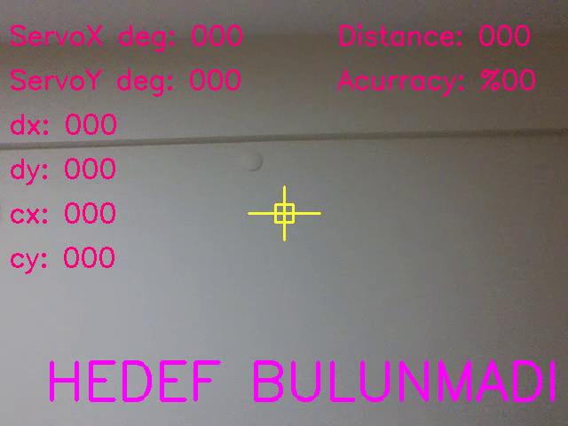
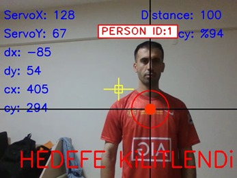
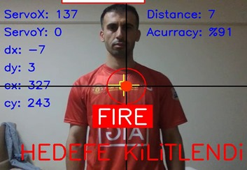
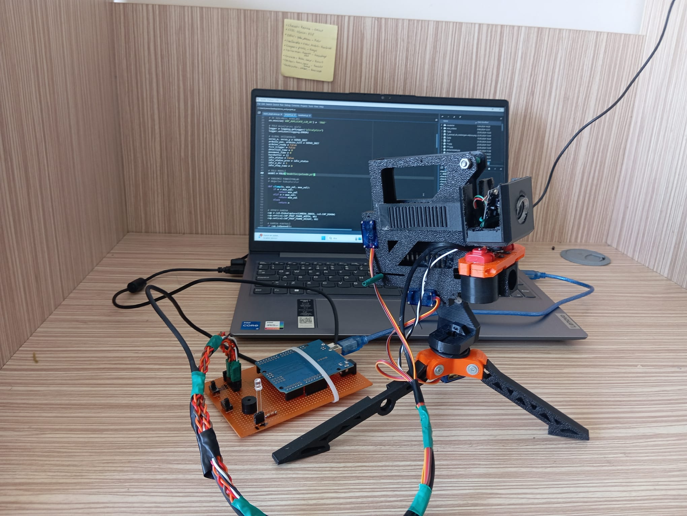
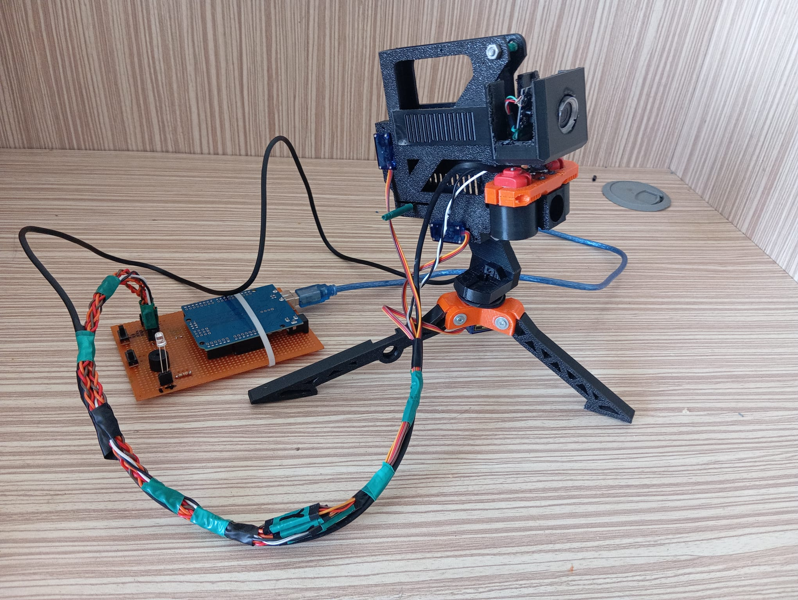

<div align="center">
  <h1>🎯 Autonomous Vision Tracking System</h1>
  <p><strong>Real-time Human Detection & Tracking with Deep Learning</strong></p>
  
  
  
  
  
  
</div>

---

## 📋 Table of Contents

- [Overview](#-overview)
- [Key Features](#-key-features)
- [System Architecture](#-system-architecture)
- [Demo](#-demo)
- [Installation](#-installation)
- [Hardware Requirements](#-hardware-requirements)
- [Usage](#-usage)
- [Configuration](#-configuration)
- [How It Works](#-how-it-works)
- [Project Structure](#-project-structure)
- [Troubleshooting](#-troubleshooting)
- [Contributing](#-contributing)
- [License](#-license)
- [Contact](#-contact)

---

## 🌟 Overview

This project implements an **autonomous vision tracking system** that uses **YOLOv8 deep learning model** and **OpenCV** for real-time human detection and tracking. The system automatically adjusts camera orientation using **Arduino-controlled servo motors** to keep the target in frame, and can trigger actions based on proximity.

**Built with:**
- 🧠 YOLOv8 for object detection
- 👁️ OpenCV for computer vision
- 🤖 Arduino for hardware control
- 🎥 Real-time video processing
- ⚡ Multi-threading for smooth operation

---

## ✨ Key Features

### 🎯 Detection & Tracking
- **Real-time human detection** using state-of-the-art YOLOv8 model
- **Automatic target tracking** with smooth servo motor movements
- **Multiple target handling** with priority selection
- **Lost target recovery** with intelligent scanning mode

### 🔧 Hardware Integration
- **Arduino servo control** via serial communication
- **Pan-tilt mechanism** for 2-axis camera movement
- **Configurable movement parameters** (speed, smoothness, limits)
- **Multi-threaded communication** for lag-free operation

### 📹 Recording & Visualization
- **Optional video recording** with timestamp
- **Real-time bounding boxes** and detection confidence
- **Distance estimation** and proximity alerts
- **FPS counter** and performance monitoring

### ⚙️ Smart Features
- **Automatic scanning mode** when target is lost
- **Configurable detection zones** and exclusion areas
- **Servo angle limiting** to prevent mechanical damage
- **Proximity-based action triggering**

---

## 🏗️ System Architecture

```
┌─────────────────┐
│   Webcam/Camera │
└────────┬────────┘
         │ Video Stream
         ▼
┌─────────────────────────┐
│   YOLOv8 Detection      │
│   (Ultralytics)         │
└────────┬────────────────┘
         │ Bounding Boxes
         ▼
┌─────────────────────────┐
│   Tracking Algorithm    │
│   - Calculate Center    │
│   - Compute Angles      │
└────────┬────────────────┘
         │ Servo Commands
         ▼
┌─────────────────────────┐
│   Arduino Controller    │
│   (Serial Communication)│
└────────┬────────────────┘
         │ PWM Signals
         ▼
┌─────────────────────────┐
│   Servo Motors          │
│   (Pan & Tilt)          │
└─────────────────────────┘
```

---

## 🎬 Demo

### Detection in Action
<p float="left">
  
  
  
</p>
*Real-time human detection and tracking*

### Robot Appearance 
<p float="left">
  
  
</p>
---

## 🚀 Installation

### Prerequisites
- Python 3.8 or higher
- Arduino IDE (for uploading servo control sketch)
- USB Webcam or compatible camera
- Arduino board (Uno, Nano, Mega, etc.)
- 2x Servo motors (SG90 or similar)

### Step 1: Clone the Repository

```bash
git clone https://github.com/Ai-rezzak/autonomous-vision-tracking.git
cd autonomous-vision-tracking
```

### Step 2: Install Python Dependencies

```bash
pip install -r requirements.txt
```

**requirements.txt contents:**
```
opencv-python>=4.8.0
ultralytics>=8.0.0
pyserial>=3.5
cvzone>=1.5.6
numpy>=1.24.0
```

### Step 3: Download YOLO Model

The YOLOv8n model will be automatically downloaded on first run, or you can manually place it:

```bash
# Create models directory
mkdir -p models/pretrained

# Model will auto-download to this location
# Or manually download from: https://github.com/ultralytics/assets/releases
```

### Step 4: Arduino Setup

1. Open `arduino/servo_control/servo_control.ino` in Arduino IDE
2. Install required libraries: `Servo.h`
3. Upload the sketch to your Arduino
4. Note the COM port (e.g., COM7 on Windows, /dev/ttyUSB0 on Linux)

---

## 🔌 Hardware Requirements

### Components List

| Component | Specification | Quantity |
|-----------|--------------|----------|
| Arduino Board | Uno/Nano/Mega | 1 |
| Servo Motors | SG90 (or similar) | 2 |
| USB Webcam | 720p or higher | 1 |
| Pan-Tilt Bracket | 2-axis servo mount | 1 |
| Jumper Wires | Male-to-Male | 6 |
| USB Cable | Type-A to Type-B | 1 |
| Power Supply | 5V 2A (for servos) | 1 |

### Wiring Diagram

```
Arduino          Servo X (Pan)      Servo Y (Tilt)
  5V     ──────>    VCC      ──────>    VCC
  GND    ──────>    GND      ──────>    GND
  D9     ──────>    Signal
  D10    ─────────────────────────>    Signal
```

**Important Notes:**
- Connect servo power to external 5V supply for stable operation
- Ensure common ground between Arduino and servo power supply
- Use capacitor (100-1000µF) near servo power for noise reduction

---

## 💻 Usage

### Basic Usage

```bash
# Run with default settings
python otonom_silah.py

# Run without video recording
python otonom_silah.py --no-record

# Use different camera
python otonom_silah.py --camera 0

# Specify Arduino port
python otonom_silah.py --port COM3
```

### Keyboard Controls

| Key | Action |
|-----|--------|
| `q` | Quit application |
| `r` | Toggle video recording |
| `s` | Save current frame |
| `c` | Calibrate servo center |
| `ESC` | Emergency stop |

### First Run Checklist

1. ✅ Connect Arduino and upload sketch
2. ✅ Connect webcam
3. ✅ Note Arduino COM port
4. ✅ Update `ARDUINO_PORT` in config
5. ✅ Run `python otonom_silah.py`
6. ✅ Press 'q' to quit

---

## ⚙️ Configuration

### Main Configuration (`otonom_silah.py`)

```python
# Camera Settings
CAMERA_INDEX = 1          # Camera device index (0 for default, 1 for USB)
WS, HS = 640, 480        # Frame width and height
H_FOV = 75.7             # Horizontal field of view (degrees)
V_FOV = 50.0             # Vertical field of view (degrees)

# Servo Settings
SERVO_INIT = (90, 110)   # Initial servo angles (X, Y)
SERVO_MIN_X = 30         # Minimum X angle
SERVO_MAX_X = 150        # Maximum X angle
SERVO_MIN_Y = 60         # Minimum Y angle
SERVO_MAX_Y = 160        # Maximum Y angle

# Arduino Communication
ARDUINO_PORT = "COM7"    # Serial port (Linux: "/dev/ttyUSB0")
ARDUINO_BAUD = 115200    # Baud rate

# Detection Settings
CONFIDENCE_THRESHOLD = 0.5    # Minimum detection confidence
TARGET_CLASS = 0              # YOLO class ID for person

# Timing Settings
NO_DETECTION_DELAY = 1.0      # Delay before entering scan mode (seconds)
MOVEMENT_DELAY = 0.5          # Minimum time between servo movements
SCAN_STEP = 15                # Angle step during scanning mode

# Recording Settings
SAVE_AS_VIDEO = True          # Enable video recording
VIDEO_FPS = 20                # Output video framerate
VIDEO_CODEC = "mp4v"          # Video codec (mp4v, XVID, etc.)
```

### Advanced Tuning

**For faster tracking:**
```python
MOVEMENT_DELAY = 0.2          # Reduce delay
CONFIDENCE_THRESHOLD = 0.6    # Increase confidence
```

**For smoother movements:**
```python
MOVEMENT_DELAY = 0.8          # Increase delay
SCAN_STEP = 10                # Smaller scan steps
```

**For better detection:**
```python
CONFIDENCE_THRESHOLD = 0.4    # Lower threshold
WS, HS = 1280, 720           # Higher resolution
```

---

## 🔧 How It Works

### 1. **Initialization Phase**

```python
# Camera setup
cap = cv2.VideoCapture(CAMERA_INDEX)
cap.set(3, WS)  # Width
cap.set(4, HS)  # Height

# YOLO model loading
model = YOLO("models/pretrained/yolov8n.pt")

# Arduino connection
arduino = serial.Serial(ARDUINO_PORT, ARDUINO_BAUD)
```

### 2. **Detection Loop**

```python
while True:
    # Capture frame
    ret, frame = cap.read()
    
    # Run YOLO detection
    results = model(frame, stream=True)
    
    # Process detections
    for r in results:
        boxes = r.boxes
        for box in boxes:
            # Extract bounding box
            x1, y1, x2, y2 = box.xyxy[0]
            conf = box.conf[0]
            cls = box.cls[0]
            
            # Filter person class
            if cls == 0 and conf > CONFIDENCE_THRESHOLD:
                # Calculate center point
                cx = int((x1 + x2) / 2)
                cy = int((y1 + y2) / 2)
```

### 3. **Tracking Algorithm**

```python
# Calculate offset from image center
offset_x = cx - (WS / 2)
offset_y = cy - (HS / 2)

# Convert pixel offset to angle change
angle_x_change = (offset_x / (WS / 2)) * (H_FOV / 2)
angle_y_change = (offset_y / (HS / 2)) * (V_FOV / 2)

# Update servo positions
new_servo_x = current_x + angle_x_change
new_servo_y = current_y - angle_y_change

# Apply limits
new_servo_x = max(SERVO_MIN_X, min(SERVO_MAX_X, new_servo_x))
new_servo_y = max(SERVO_MIN_Y, min(SERVO_MAX_Y, new_servo_y))

# Send to Arduino
send_command(f"{int(new_servo_x)},{int(new_servo_y)}\n")
```

### 4. **Scanning Mode**

```python
if time.time() - last_detection > NO_DETECTION_DELAY:
    # Enter scanning mode
    if scanning_direction == "right":
        servo_x += SCAN_STEP
        if servo_x >= SERVO_MAX_X:
            scanning_direction = "left"
    else:
        servo_x -= SCAN_STEP
        if servo_x <= SERVO_MIN_X:
            scanning_direction = "right"
```

### 5. **Proximity Detection**

```python
# Calculate approximate distance
box_height = y2 - y1
distance_estimate = (KNOWN_HEIGHT * FOCAL_LENGTH) / box_height

if distance_estimate < FIRE_DISTANCE:
    # Trigger action
    send_command("FIRE\n")
```

---

## 📁 Project Structure

```
autonomous-vision-tracking/
│
├── arduino/
│   └── servo_control/
│       └── servo_control.ino       # Arduino servo control code
│
├── models/
│   ├── pretrained/
│   │   └── yolov8n.pt             # YOLOv8 nano model
│   └── trained/
│       └── custom_model.pt         # Custom trained models (optional)
│
├── data/
│   ├── images/                     # Sample images for testing
│   └── videos/                     # Sample videos for testing
│
├── docs/
│   ├── images/                     # Documentation images
│   ├── INSTALLATION.md             # Detailed installation guide
│   └── HARDWARE.md                 # Hardware setup guide
│
├── new_videos/                     # Output video recordings
│
├── utils/
│   ├── __init__.py
│   ├── arduino_comm.py            # Arduino communication utilities
│   ├── tracking.py                # Tracking algorithms
│   └── video_utils.py             # Video recording utilities
│
├── otonom_silah.py                # Main application file
├── requirements.txt               # Python dependencies
├── .gitignore                     # Git ignore file
├── LICENSE                        # MIT License
└── README.md                      # This file
```

---

## 🐛 Troubleshooting

### Camera Not Detected

**Problem:** `cv2.VideoCapture()` returns False

**Solutions:**
- Try different camera index (0, 1, 2)
- Check camera connection and permissions
- On Linux: `sudo usermod -a -G video $USER`
- Install camera drivers

### Arduino Connection Failed

**Problem:** `serial.SerialException: could not open port`

**Solutions:**
- Check COM port in Device Manager (Windows)
- On Linux: `ls /dev/ttyUSB* or ls /dev/ttyACM*`
- Grant port permissions: `sudo chmod 666 /dev/ttyUSB0`
- Install Arduino drivers
- Close Arduino IDE (releases the port)

### Servo Jittering

**Problem:** Servos move erratically

**Solutions:**
- Use external power supply for servos
- Add delay: `MOVEMENT_DELAY = 1.0`
- Add smoothing to angle calculations
- Check servo connections
- Add capacitor to power line

### Low FPS

**Problem:** Application runs slowly

**Solutions:**
- Reduce resolution: `WS, HS = 320, 240`
- Use lighter model: YOLOv8n instead of YOLOv8s
- Disable video recording
- Close other applications
- Use GPU if available

### YOLO Model Not Loading

**Problem:** `FileNotFoundError: yolov8n.pt not found`

**Solutions:**
- Check internet connection (auto-downloads on first run)
- Manually download from [Ultralytics GitHub](https://github.com/ultralytics/assets/releases)
- Place in `models/pretrained/` directory
- Verify file path in code

### No Detection

**Problem:** Model doesn't detect people

**Solutions:**
- Increase lighting in the room
- Lower confidence threshold: `CONFIDENCE_THRESHOLD = 0.3`
- Check if camera is not blocked
- Test with different YOLO models
- Verify person is in frame

---

## 🤝 Contributing

Contributions are welcome! Here's how you can help:

### Ways to Contribute

- 🐛 Report bugs and issues
- 💡 Suggest new features
- 📝 Improve documentation
- 🔧 Submit pull requests
- ⭐ Star the repository

### Development Setup

```bash
# Fork and clone
git clone https://github.com/YOUR_USERNAME/autonomous-vision-tracking.git
cd autonomous-vision-tracking

# Create virtual environment
python -m venv venv
source venv/bin/activate  # Linux/Mac
venv\Scripts\activate     # Windows

# Install dev dependencies
pip install -r requirements-dev.txt

# Create a branch
git checkout -b feature/your-feature-name

# Make changes and commit
git add .
git commit -m "Add your feature"

# Push and create PR
git push origin feature/your-feature-name
```

### Code Style

- Follow PEP 8 guidelines
- Add docstrings to functions
- Comment complex logic
- Write meaningful commit messages

---

## 📄 License

This project is licensed under the **MIT License** - see the [LICENSE](LICENSE) file for details.

```
MIT License

Copyright (c) 2024 Abdurrezzak ŞIK

Permission is hereby granted, free of charge, to any person obtaining a copy
of this software and associated documentation files (the "Software"), to deal
in the Software without restriction...
```

---

## 📧 Contact

**Abdurrezzak ŞIK**

- 📧 Email: [rezzak.eng@gmail.com](mailto:rezzak.eng@gmail.com)
- 💼 LinkedIn: [linkedin.com/in/abdurrezzak-şık](https://www.linkedin.com/in/abdurrezzak-%C5%9F%C4%B1k-64b919233/)
- 🐙 GitHub: [@Ai-rezzak](https://github.com/Ai-rezzak)

---

## 🙏 Acknowledgments

- [Ultralytics](https://github.com/ultralytics/ultralytics) for YOLOv8
- [OpenCV](https://opencv.org/) for computer vision tools
- Arduino community for servo control examples
- All contributors and supporters

---

## 📊 Project Stats


---

<div align="center">
  <p><strong>⭐ If you found this project useful, please consider giving it a star! ⭐</strong></p>
  <p>Made with ❤️ by Abdurrezzak ŞIK</p>
</div>
